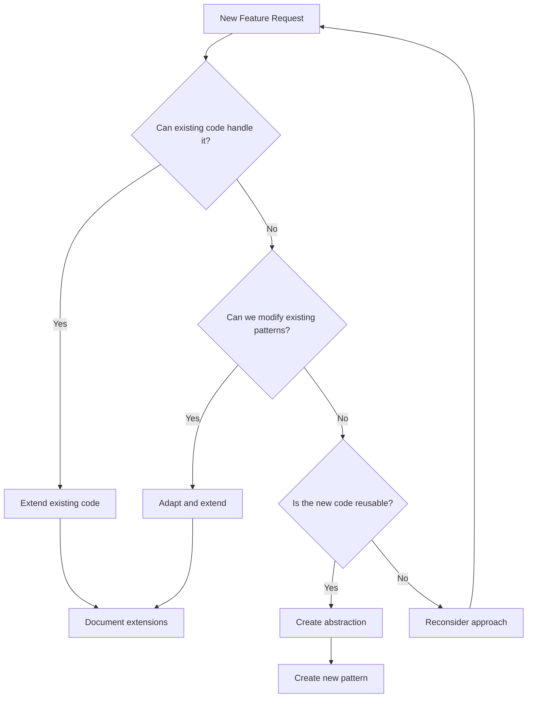

# Code Optimization Principles & Extended Thinking Framework

## Overview

This document establishes optimization principles based on successful patterns from our codebase, particularly the 87% code reduction achieved in the trial user upgrade flow optimization. These principles leverage extended thinking methodologies to ensure thorough analysis before implementation.

## Core Philosophy

> "The best code is no code. The second best code is code that already exists and works."

### The LEVER Framework

**L**everage existing patterns  
**E**xtend before creating  
**V**erify through reactivity  
**E**liminate duplication  
**R**educe complexity

## 🧠 Extended Thinking Process

Based on [Anthropic's Extended Thinking methodology](https://docs.anthropic.com/en/docs/build-with-claude/extended-thinking), always follow this decision tree:



## 📋 Pre-Implementation Checklist

Before writing any code, complete this extended thinking exercise:

### 1. Pattern Recognition Phase (10-15 minutes)

```markdown
## Existing Pattern Analysis

- [ ] What similar functionality already exists?
- [ ] Which queries/mutations handle related data?
- [ ] What UI components display similar information?
- [ ] Which hooks manage related state?

## Code Reuse Opportunities

- [ ] Can I extend an existing table instead of creating a new one?
- [ ] Can I add fields to an existing query return?
- [ ] Can I enhance an existing hook with new computed properties?
- [ ] Can I modify an existing component with conditional rendering?
```

### 2. Complexity Assessment (5-10 minutes)

```markdown
## Proposed Solution Complexity

- Lines of new code: \_\_\_
- New files created: \_\_\_
- New database tables: \_\_\_
- New API endpoints: \_\_\_

## Optimized Alternative

- Lines extending existing code: \_\_\_
- Files modified: \_\_\_
- Fields added to existing tables: \_\_\_
- Existing endpoints enhanced: \_\_\_

If optimized < 50% of proposed, proceed with optimization.
```

## 📊 Decision Framework

### When to Extend vs Create New

Use this scoring system (inspired by [Extended Thinking with Tool Use](https://github.com/anthropics/anthropic-cookbook/blob/main/extended_thinking/extended_thinking_with_tool_use.ipynb)):

| Criteria                              | Extend Existing | Create New |
| ------------------------------------- | --------------- | ---------- |
| Similar data structure exists         | +3 points       | -3 points  |
| Can reuse existing indexes            | +2 points       | -2 points  |
| Existing queries return related data  | +3 points       | -3 points  |
| UI components show similar info       | +2 points       | -2 points  |
| Would require <50 lines to extend     | +3 points       | -3 points  |
| Would introduce circular dependencies | -5 points       | +5 points  |
| Significantly different domain        | -3 points       | +3 points  |

**Score > 5**: Extend existing code  
**Score < -5**: Create new implementation  
**Score -5 to 5**: Deeper analysis required

## 🛠️ Implementation Strategies

### 1. The Three-Pass Approach

Inspired by [Extended Thinking Tips](https://docs.anthropic.com/en/docs/build-with-claude/prompt-engineering/extended-thinking-tips):

**Pass 1: Discovery (No Code)**

- Find all related existing code
- Document current patterns
- Identify extension points

**Pass 2: Design (Minimal Code)**

- Write interface changes only
- Update type definitions
- Plan data flow

**Pass 3: Implementation (Optimized Code)**

- Implement with maximum reuse
- Add only essential new logic
- Document why choices were made

### 2. Code Reuse Patterns

#### Pattern: Feature Flags in Existing Components

```typescript
// Instead of new component
export function SubscriptionStatus() {
  const { userStatus, campaignData } = useSubscription();

  return (
    <>
      {/* Existing UI */}

      {/* Conditionally show new features */}
      {campaignData?.isTrialFromCampaign && (
        <CampaignBadge source={campaignData.source} />
      )}
    </>
  );
}
```

## ⚡ Performance Optimization Rules

### 1. Query Efficiency

```typescript
// ❌ Multiple queries
const user = fetch(api.users.getUser);
const subscription = fetch(api.subscriptions.getSubscription);
const usage = fetch(api.usage.getUsage);

// ✅ Single query returning all data
const userStatus = fetch(api.users.getUserStatus);
// Returns user + subscription + usage in one call
```

### 2. Batch Operations

```typescript
// ❌ Sequential operations
for (const item of items) {
  await fetch(item._id, updates);
}

// ✅ Batch when possible
const promises = items.map((item) => fetch(item._id, updates));
await Promise.all(promises);
```

## 🚫 Anti-Patterns to Avoid

### 1. The "Similar But Different" Excuse

Before creating `getUserTrialStatus` when `getUserStatus` exists:

- Can getUserStatus return trial fields?
- Can we add a `includeTrial` parameter?
- Can computed properties derive what we need?

### 2. The "UI Drives Database" Mistake

Never create database structure to match UI components. Instead:

- Store data in its most logical form
- Use queries to transform for UI
- Let components compute display values

## 🎯 Success Metrics

Track optimization success:

| Metric                             | Target              |
| ---------------------------------- | ------------------- |
| Code reduction vs initial approach | >50%                |
| Reused existing patterns           | >70%                |
| New files created                  | <3 per feature      |
| New database tables                | 0 (extend existing) |
| Query complexity                   | No new indexes      |
| Implementation time                | <50% of estimate    |

## 🔍 Review Checklist

Before submitting optimized code:

- [ ] Extended existing tables instead of creating new ones
- [ ] Reused existing queries with additions
- [ ] Leveraged existing hooks and components
- [ ] No duplicate state management logic
- [ ] Documented why extensions were chosen
- [ ] Maintained backward compatibility
- [ ] Added fields are optional (v.optional)
- [ ] No circular dependencies introduced
- [ ] Performance same or better
- [ ] Code reduction >50%

## 📚 References

- [Extended Thinking Documentation](https://docs.anthropic.com/en/docs/build-with-claude/extended-thinking)
- [Extended Thinking Tips](https://docs.anthropic.com/en/docs/build-with-claude/prompt-engineering/extended-thinking-tips)

---

## Related Documentation

For practical implementation, see:

- [🏗️ Complete Project Architecture](../02-architecture/02-project-architecture.md) - Full technical architecture details
- [📋 Development Overview](../03-development/01-overview.md) - Development workflows and scenarios
- [🏗️ Component Implementation Guide](../03-development/04-component-implementation-guide.md) - The single source of truth for creating components.
- [📝 Field Types Guide](../03-development/05-field-types-guide.md) - Storyblok field types and schema patterns
- [🎨 Design Guide](../03-development/02-design-guide.md) - UI/UX guidelines and design system

---

_Remember: Every line of code is a liability. The best feature is one that requires no new code, just better use of what exists._